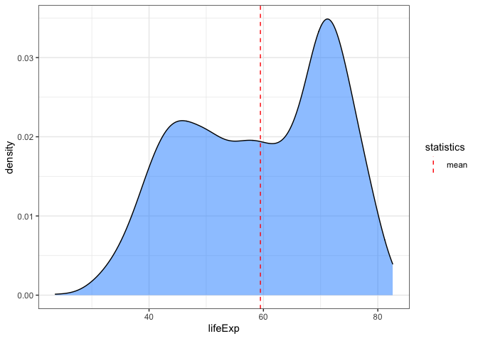
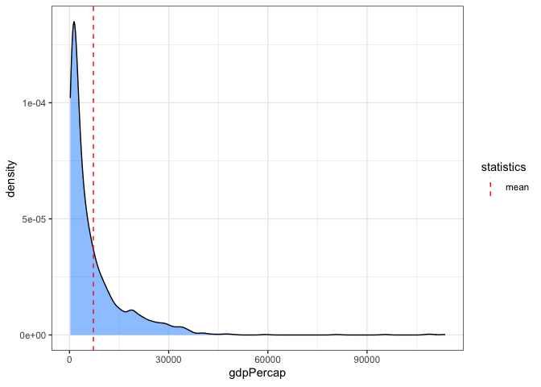
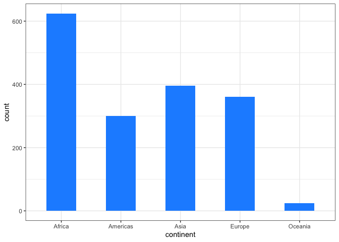

<!-- README.md is generated from README.Rmd. Please edit that file -->

# qplots

## Overview

<!-- badges: start -->
<!-- badges: end -->

qplots provides a function to plot the distribution of variables in a
data frame so that basic statistics of variables can be obtained
immediately.

-   `diquick_dist()`: Plots density distribution of numeric variables
    and bar plot of category/factor variables in a data frame.

## Installation

You can install the development version of qplots from the GitHub
repository like so:

``` r
devtools::install_github("HosseinEbrahimiK/qplots")
```

## Usage

These are basic examples that demonstrate some use cases of our function
for datasets. We have used the `gapminder` dataset for this purpose. The
first two examples are numerical variables, and the outputs are density
distributions as expected. The last example includes a categorical
column in the data, which the result will be a bar plot of frequencies.

``` r
library(qplots)

quick_dist(gapminder::gapminder, "lifeExp") # a numeric variable
```



``` r
quick_dist(gapminder::gapminder, "gdpPercap") # a numeric variable
```



``` r
quick_dist(gapminder::gapminder, "continent") # a categorical variable
```



## Getting help

If you find any bugs or errors, please post an issue on
[GitHub](https://github.com/HosseinEbrahimiK/qplots/issues).

------------------------------------------------------------------------

Please note that this package is a part of assignments of *[STAT 545B @
UBC](https://stat545.stat.ubc.ca/syllabus-545b/)* course.
